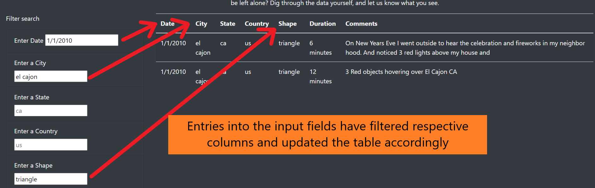

:flying_saucer:	 # UFOs :flying_saucer:	

## Purpose

We have built a webpage with a dynamic table(information filters and table updates according to user selected inputs) in order to help Dana provide an in-depth analysis to support her journalism article around UFOs sightings. We have used Javascript and D3.js along with HTML, bootstrap and some CSS to help us build a user-friendly web-page that gives impactful support to Dana's article.

## Results

The webpage has a clean layout and presents the reader with Dana's article to start off and once they scroll down, the user can view the table with UFO sighting data, and towards the left of the table, input fields to filter the table.

The image below shows the location of the table where reader can input values to filter the data and update table accordingly.

Once the reader inputs the text, the respective field is filtered to match results and update the table. The image below shows updated table where the city has been filtered to match values with city name "el cajon"

The reader can also input data in multiple fields and the data is filtered according to all the fields with valid data and the table is updated. The image below shows updated table where the following filters have been applied.
* City = el cajon
* Date = 1/1/2010
* Shape = triangle

## Summary

Using of dynamic tables provides a user-friendly option to filter and update data. However, there are some drawbacks and improvements that can be made.

### Drawbacks

:-1: The major drawback is that there is **no validation** on any of the input fields which allows the possibility for any data to be entered, with the resulting table showing no data if unless the data absolutely matches one of the entries in respective column.

### Recommendations for future
:arrow_up:	Convert some of the input fields to drop-down menus so that the user can select the data instead of having to type the text in manually. This reduces the chances of errors
:arrow_up:	Clean the data in certain columns like the "Duration" which hold data in differing units like 10:00, a few minutes, 2-3 minutes, noticed from dusk to dawn etc. The result should be some standardized duration data for all the rows
